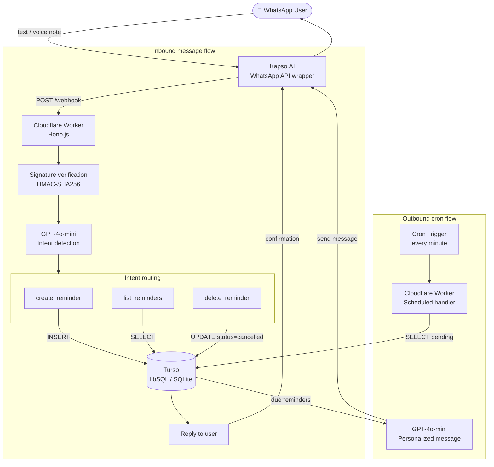

# reminder-ai

A WhatsApp reminder bot powered by AI. Send a voice note or text message describing what you need to remember and when — the bot parses it, stores it, and sends you a personalized reminder at the right time.

Built on Cloudflare Workers (zero cold starts, global edge, free cron triggers) with Turso as the database and OpenAI for natural language understanding.

## Features

- **Natural language input** — "Remind me tomorrow at 3pm to call the dentist"
- **Voice note support** — Kapso auto-transcribes audio messages
- **Personalized reminders** — GPT generates a creative, human-sounding message instead of a generic notification
- **List reminders** — "What are my pending reminders?"
- **Delete reminders** — "Delete number 2"
- **Multilingual** — responds in the same language the user writes in

## Architecture



### Key design decisions

- **Cloudflare Workers** eliminates infrastructure management. No servers, no sleep/wake cycles, built-in cron triggers, and a generous free tier.
- **Turso** provides cloud-hosted SQLite. The schema is identical to a local SQLite file — same Drizzle ORM, same queries — but accessible from the edge without a connection pool.
- **Stateless intent detection** — GPT classifies each message as `create_reminder`, `list_reminders`, `delete_reminder`, or `error`. No session state needed.
- **Async webhook processing** — the Worker returns 200 to Kapso immediately and processes the message via `waitUntil()`, preventing retries from duplicate reminders.

## Tech stack

| Layer | Technology |
|---|---|
| Runtime | Cloudflare Workers |
| HTTP framework | Hono.js |
| Database | Turso (libSQL / SQLite) |
| ORM | Drizzle ORM |
| NLP | OpenAI GPT-4o-mini |
| WhatsApp | Kapso.AI |
| Scheduler | Workers Cron Triggers |
| Language | TypeScript |
| Package manager | Bun |

## Project structure

```
src/
├── index.ts              # Worker entry point — Hono app + scheduled handler
├── db/
│   ├── schema.ts         # Drizzle table definitions
│   └── client.ts         # Turso client + schema bootstrap
├── routes/
│   └── webhook.ts        # POST /webhook — signature verify + intent routing
├── scheduler/
│   └── index.ts          # Cron handler — send due reminders
├── services/
│   ├── openai.ts         # Intent parsing + personalized message generation
│   └── kapso.ts          # WhatsApp send via Kapso API
└── utils/
    └── webhook-verify.ts # HMAC-SHA256 signature verification (Web Crypto API)
```

## Prerequisites

- [Bun](https://bun.sh)
- [Cloudflare account](https://cloudflare.com) (free)
- [Turso account](https://turso.tech) (free)
- [OpenAI API key](https://platform.openai.com)
- [Kapso.AI account](https://app.kapso.ai) with a WhatsApp number configured

## Setup

### 1. Clone and install

```bash
git clone https://github.com/your-username/reminder-ai
cd reminder-ai
bun install
```

### 2. Create the Turso database

```bash
# Install Turso CLI
curl -sSfL https://get.tur.so/install.sh | bash

# Create the database
turso db create reminder-ai

# Get the connection URL
turso db show reminder-ai --url

# Create an auth token
turso db tokens create reminder-ai
```

Save both values — you'll need them as secrets.

### 3. Configure Cloudflare Workers

Authenticate with your Cloudflare account:

```bash
bunx wrangler login
```

Set the required secrets (each command prompts for the value):

```bash
bunx wrangler secret put KAPSO_API_KEY
bunx wrangler secret put KAPSO_PHONE_NUMBER_ID
bunx wrangler secret put KAPSO_WEBHOOK_SECRET
bunx wrangler secret put OPENAI_API_KEY
bunx wrangler secret put TURSO_DATABASE_URL
bunx wrangler secret put TURSO_AUTH_TOKEN
```

| Secret | Where to find it |
|---|---|
| `KAPSO_API_KEY` | Kapso dashboard → Project Settings → API Keys |
| `KAPSO_PHONE_NUMBER_ID` | Kapso dashboard → your WhatsApp number |
| `KAPSO_WEBHOOK_SECRET` | Kapso dashboard → Webhook configuration |
| `OPENAI_API_KEY` | platform.openai.com → API keys |
| `TURSO_DATABASE_URL` | `turso db show reminder-ai --url` |
| `TURSO_AUTH_TOKEN` | `turso db tokens create reminder-ai` |

### 4. Deploy

```bash
bun run deploy
```

The CLI prints the Worker URL:
```
https://reminder-ai.<your-subdomain>.workers.dev
```

### 5. Configure the Kapso webhook

In the Kapso dashboard, set the webhook URL to:
```
https://reminder-ai.<your-subdomain>.workers.dev/webhook
```

The database schema is created automatically on the first cron trigger execution (within 1 minute of deployment).

## Environment variables

Non-sensitive variables are set in `wrangler.toml`:

| Variable | Default | Description |
|---|---|---|
| `DEFAULT_TIMEZONE` | `America/Argentina/Buenos_Aires` | IANA timezone for interpreting relative times ("tomorrow", "at noon") |
| `SKIP_WEBHOOK_SIGNATURE` | `false` | Set to `true` to skip signature verification during local development |

## Local development

```bash
bun run dev
```

This starts a local Worker via Wrangler. Use a tunneling tool like [ngrok](https://ngrok.com) to expose it and point your Kapso webhook to the tunnel URL. Set `SKIP_WEBHOOK_SIGNATURE = "true"` in `wrangler.toml` for local testing.

## Database schema

A single `reminders` table:

| Column | Type | Description |
|---|---|---|
| `id` | INTEGER PK | Auto-increment |
| `phone` | TEXT | Sender phone in E.164 format |
| `message` | TEXT | Parsed reminder content |
| `scheduled_at` | TEXT | ISO 8601 UTC datetime |
| `sent_at` | TEXT | Delivery timestamp (null until sent) |
| `status` | TEXT | `pending` · `sent` · `failed` · `cancelled` |
| `raw_input` | TEXT | Original user message (for debugging) |
| `created_at` | TEXT | ISO 8601 UTC datetime |

## License

MIT
